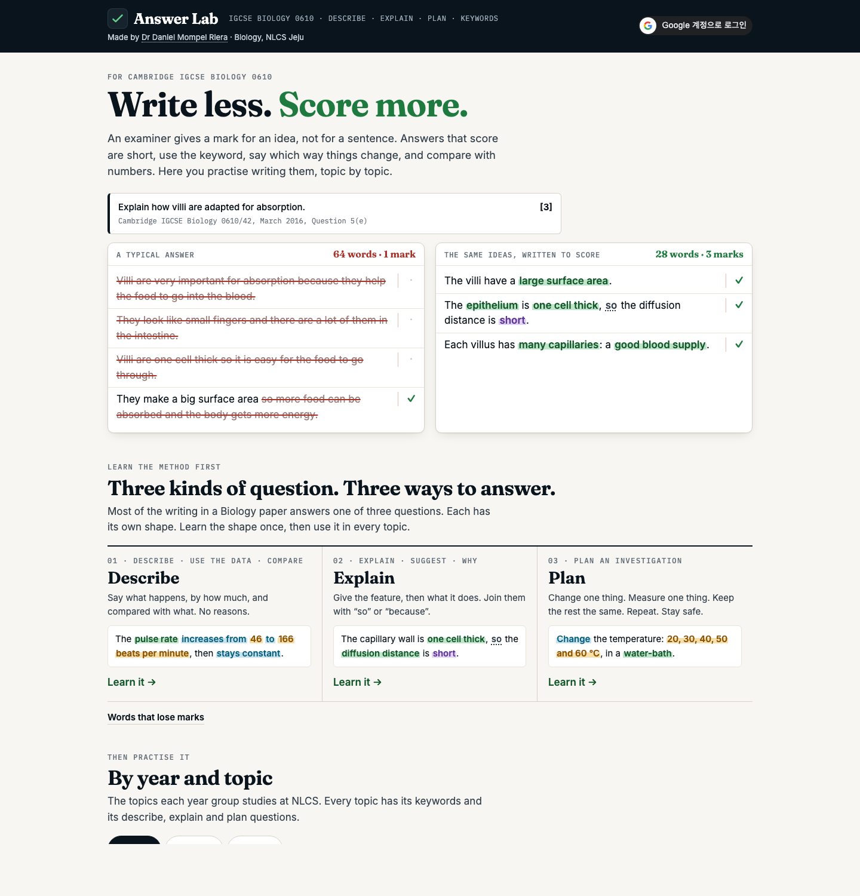

<h1>✍️ &nbsp;Bio English Lab</h1>

**Write less. Score more. — the sentences that earn marks in Cambridge IGCSE Biology 0610**

     

by **Dr Daniel Mompel Riera** · NLCS Jeju

---

## What a student does

Most of the writing in a Biology paper answers one of three questions: **describe**, **explain** or
**plan an investigation**. Each has its own shape. Bio English Lab teaches the shape, then practises it
topic by topic, with the keywords every answer needs.

| | |
|---|---|
| **Learn the method** | Three short lessons: how a describe, an explain and a plan answer are built, and the words examiners do not credit. |
| **Practise by topic** | Year 9, 10 and 11, organised as NLCS teaches them. Every topic has keyword sets and describe, explain and plan sets. |
| **Answer without free writing** | Choose the answer that scores, choose the right words, build the sentence from pieces, fix weak words, cut the words that score nothing, put a chain in order, type the keyword, mark an answer as the examiner would, then answer a real exam question step by step: think, order, write. |
| **See the model answer** | One line, one mark, with the keyword, the direction, the comparison, the data and the link each in their own colour. |

> [!NOTE]
> Every question names the real Cambridge past paper or syllabus statement it is based on. Model
> answers are written from the real mark scheme's own points.

## For teachers

Set any sets as homework, for a class or for particular students, and post them to Google
Classroom — from the same teacher page, spreadsheet and homework list as the
[Biology Labs](https://nlcsbiology.com/biology-hub/), so one homework can mix lab stations and
English sets. Students who sign in with their school Google account are recorded in its
"✍️ Bio English" tab. The script is in the Biology Hub repository, `apps-script/`.

The keyword definitions are the same list as the flashcards in the reflection system's student
dashboard, so the two never teach a word two ways.

<b>Behind the scenes</b> — how this works, in plain English

- **Where the questions come from.** They are written in a private folder beside this one, which is
  never published. A build step checks every question — that it has a source, a model answer, and
  a right answer among its choices — and refuses to finish if one is broken. Then a second check
  opens every question in a real browser, answers it correctly and incorrectly, and fails if either
  is marked the wrong way.
- **Why the answers are not easy to read in the page.** They are scrambled, like a covered answer
  sheet. The page has to unscramble them to show the model answer after a try, so this stops casual
  peeking, not a determined programmer.
- **Keywords typed with a slip of the finger** are accepted — but never when the slip makes another
  biology word: *meiosis* for *mitosis*, *ilium* for *ileum*, *glycogen* for *glucagon* are marked
  wrong.
- **Progress** is kept in the student's own browser. A signed-in student's progress is also sent to
  the teacher's spreadsheet, so homework can be checked and work carries on from another computer.

---

Made by **Dr Daniel Mompel Riera** · Biology, NLCS Jeju · dmompelriera@nlcsjeju.kr

## Licence

| | |
|---|---|
| **The software** — everything that runs | [AGPL-3.0](LICENSE) |
| **The teaching material** — questions, explanations, model answers | [CC BY-NC-SA 4.0](LICENSE-CONTENT) |

Use it, change it, share it with your students. You may not sell it. If you run a changed copy for
others, share your changes. Cambridge International is not connected with this site; past-paper
references are given so each question can be checked against its source.

© 2026 Dr Daniel Mompel Riera
